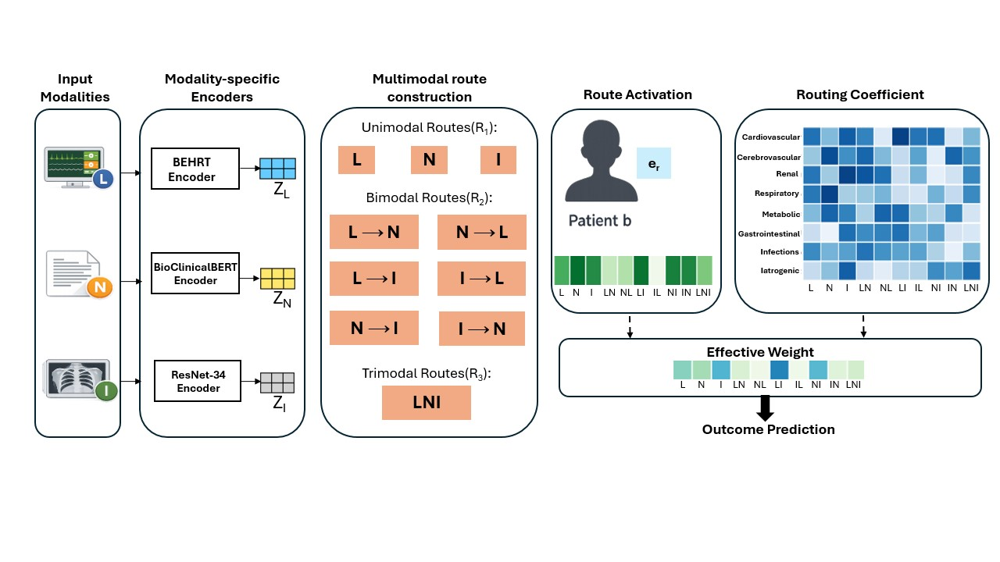

<h1 align="center">
Multimodal Routing · Interpretable, Robust, and Auditable Clinical Prediction
</h1>

<p align="center">
  <i>
  “Multimodal Routing for Interpretable, Robust, and Auditable Clinical Prediction”
  </i>
</p>

<p align="center">
  <!-- Update arXiv link when available -->
  <!--
  <a href="https://arxiv.org/abs/XXXX.XXXXX">
    
  </a>
  -->

  <a href="https://pytorch.org">
    
  </a>
</p>

<p align="center">
  <!-- Hero / architecture figure -->
  
</p>

<p align="center">
  📄 <a href="figures/model_architecture.pdf">
  View high-resolution architecture diagram (PDF)
  </a>
</p>

---

## Table of Contents

1. [Overview](#overview)  
2. [Key Contributions](#key-contributions)  
3. [Clinical Prediction Tasks](#clinical-prediction-tasks)  
4. [Method Overview](#method-overview)  
5. [Missing-Modality Robustness and Auditing](#missing-modality-robustness-and-auditing)  
6. [Data Sources](#data-sources-credentialed-access-required)  
7. [Repository Structure](#repository-structure)  
8. [Citation](#citation)  
9. [Disclaimer](#disclaimer)

---

## Overview

Electronic Health Records (EHRs) are inherently **multimodal**, combining heterogeneous sources such as structured longitudinal measurements, free-text clinical notes, and medical images. While multimodal models often improve predictive performance, most existing approaches rely on **deep fusion**, obscuring how individual modalities and their interactions contribute to predictions.

**Multimodal Routing** is a routing-based multimodal learning framework that makes multimodal reasoning **explicit, interpretable, and auditable**. The model separates unimodal signals from directional cross-modal interactions and learns **how**, **when**, and **for which outcomes** each evidence pathway contributes.

The framework operates over three core clinical modalities:

- **L** — Structured longitudinal data (vitals, laboratory values, medications)  
- **N** — Clinical notes  
- **I** — Chest X-ray images  

By explicitly modeling multimodal routes and dynamically weighting them at inference time, the framework supports:

- transparent multimodal reasoning  
- robustness to missing modalities  
- auditing of model decision pathways in realistic clinical settings  

---

## Key Contributions

- **Explicit modeling of 10 multimodal routes**
  - **3 unimodal routes**
  - **6 directional bimodal routes**  
    (e.g., `N ← L` vs. `L ← N`)
  - **1 trimodal route**

- **Route activations (patient-specific)**  
  Quantify how strongly each unimodal or cross-modal route is expressed for an individual patient.

- **Routing coefficients (patient- and label-specific)**  
  Quantify how much each route contributes to each prediction target.

- **Inference-time route masking**  
  Simulates missing-modality scenarios without retraining by disabling routes involving unavailable modalities and renormalizing routing weights.

- **Auditable multimodal reasoning**  
  Routing weight redistribution under missing-modality settings enables systematic auditing of modality reliance, robustness, and potential shortcut learning.

---

## Clinical Prediction Tasks

This codebase supports two ICU prediction tasks using paired **tri-modal** EHR data.

### Binary ICU Mortality Prediction
- Observation window: **first 48 hours** of the ICU stay

### Multi-label Phenotype Prediction
- **25 phenotypes**
- Observation window: **full ICU stay**
- **Discharge summaries are excluded** to avoid information leakage

---

## Method Overview

### Multimodal Routes

The model explicitly constructs a set of **interpretable multimodal routes**.

#### Unimodal routes
{ L, N, I }

#### Directional bimodal routes
{ L ← N, N ← L, L ← I, I ← L, N ← I, I ← N }

#### Trimodal route
{ LNI }


The trimodal route is constructed **hierarchically from paired directional interactions**.

Each route \( r \in \mathcal{R} \) produces a route-specific embedding \( e_r \) representing a distinct unimodal or cross-modal evidence pathway.

---

### Decision Mechanism

For a patient **b** and prediction target (label) **c**, the final decision representation is computed as:

d_{b,c} = Σ_{r ∈ R} R_{b,r,c} · α_{b,r} · ẽ_r

where:

- **α<sub>b,r</sub>** — *Route activation (patient-specific)*  
  Indicates how strongly route *r* is expressed for patient *b*.

- **R<sub>b,r,c</sub>** — *Routing coefficient (patient- and label-specific)*  
  Indicates how much route *r* contributes to label *c*, normalized across routes.

- **ẽ<sub>r</sub>** — *Primary route representation*  
  Content vector carrying predictive information from route *r*.

The **effective route contribution** is defined as:

W_{b,r,c} = α_{b,r} · R_{b,r,c}

This formulation enforces **structured, selective, and interpretable multimodal aggregation**, ensuring predictions are driven only by routes that are both strongly expressed for a patient and relevant to the target outcome.

---

## Missing-Modality Robustness and Auditing

Robustness is evaluated using **inference-time route masking**.

When a modality is missing:
- all routes involving that modality are disabled  
- remaining routing coefficients are renormalized  
- inference proceeds **without retraining or imputation**

Changes in routing weights and predictive performance under missing-modality scenarios provide an **audit signal** that reveals:

- modality essentiality  
- reliance on narrow vs. complementary evidence  
- potential shortcut learning  

---

## Data Sources (Credentialed Access Required)

This project uses the following PhysioNet datasets:

- **MIMIC-IV**
- **MIMIC-IV-Note**
- **MIMIC-CXR-JPG**

To use this code, you must:

1. Complete PhysioNet credentialing  
2. Agree to all applicable Data Use Agreements (DUAs)  
3. Download the data locally  

⚠️ **Important**  
This repository does **not** include any patient data.  
Do **not** upload derived tables, features, or outputs containing patient information.

---

## Repository Structure

The repository is organized by **prediction task**, with parallel pipelines for ICU mortality and phenotype prediction.

```text
MultimodalRouting/
├── Data/                         # (Local only) processed data placeholders
├── INSPECT/                      # Inspection / debugging utilities
│
├── MIMIC-IV/
│   ├── Data/                     # Task-specific data handling
│   ├── Model/                    # Shared model utilities
│   │
│   ├── MortModel/                # ICU mortality prediction
│   │   ├── Baseline/
│   │   ├── Paired_Cross_Attention/
│   │   ├── Paired_Simple_Concat/
│   │   └── Partial/
│   │
│   └── PhenoModel/               # Multi-label phenotype prediction
│       ├── Baseline/
│       ├── Paired_Cross_Attention/
│       ├── Paired_Simple_Concat/
│       └── Partial/
│
├── figures/
│   ├── model_architecture.png
│   └── model_architecture.pdf
│
└── README.md

